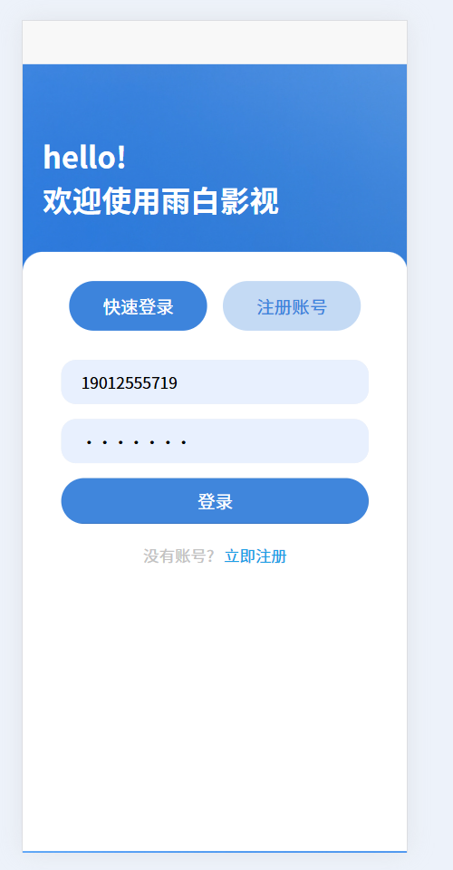
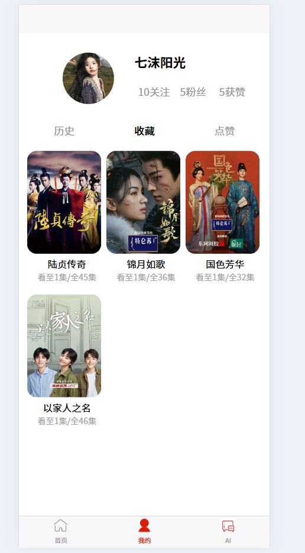
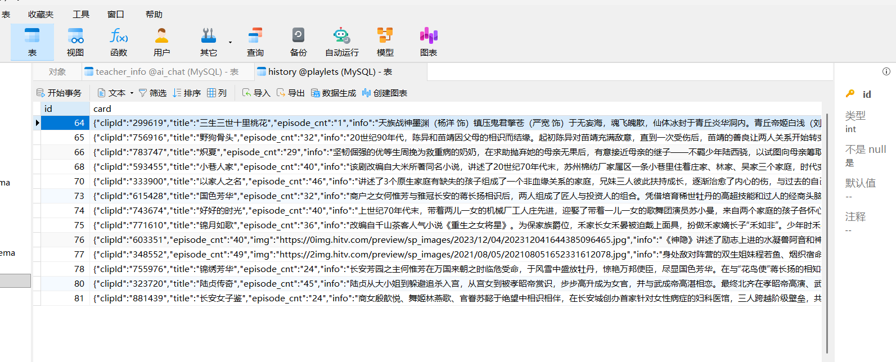
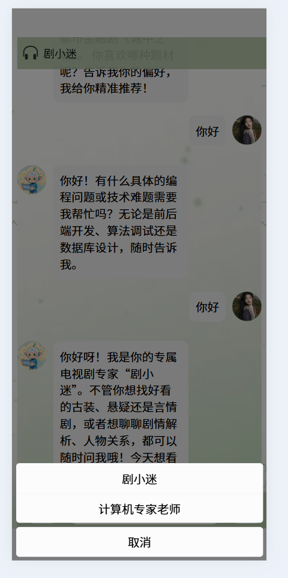
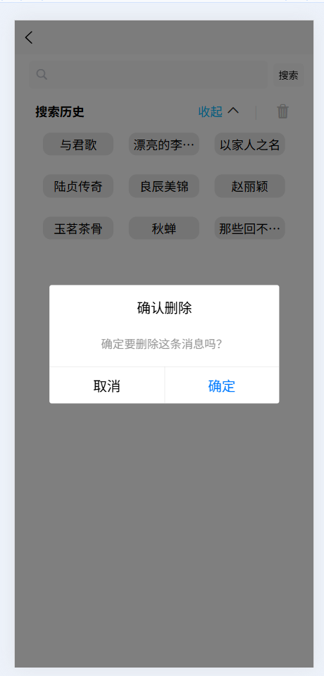

# 🎬 AI-Drama-FullStack — 全栈AI追剧应用

<div align="center">


**基于 UniApp(Vue) + Flask + MySQL + AI + 数据采集 + 数据分析的全栈跨端追剧应用**  
**一套代码，运行于 H5 与微信小程序**

</div>

---

## 📖 项目简介

**AI-Drama-FullStack** 是一款集追剧管理与智能推荐于一体的全栈应用。用户可通过登录、注册、关键词搜索剧集、查看详情、分类筛选、收藏点赞、记录观看进度，并享受 AI 智能助手的个性化推荐与互动问答。

> 这是我独立开发的全栈 + AI 综合实践项目，旨在探索 AI 能力在传统追剧场景中的落地应用。

---

## ✨ 功能特点

| 功能模块 | 说明 |
|---------|------|
| 🔐 **登录注册** | 手机号/验证码登录、密码注册，JWT 身份认证与权限管理 |
| 🏷️ **分类筛选** | 按类型（古装/现代/悬疑/爱情等）、地区、年份等多维度筛选剧集 |
| 🔍 **剧集搜索** | 关键词搜索，智能匹配推荐 |
| 📄 **剧集详情** | 展示剧集信息，选集列表，演员阵容 |
| ⭐ **收藏系统** | 一键收藏，数据持久化存储 |
| 👍 **点赞系统** | 互动点赞，实时更新状态 |
| 📜 **历史记录** | 自动记录观看进度，断点续看 |
| 🤖 **AI 智能助手** | 双角色流式对话，智能推荐剧集 |
| 📱 **跨端适配** | 一套代码，运行于 H5 和微信小程序 |
| 🎨 **精美 UI** | 统一设计系统，流畅交互体验 |
| 📊 **数据分析** | 基于用户观看数据，生成词云图和时序柱状图，为推荐优化提供数据支撑 |
---

## 🛠️ 技术栈

### 前端
- **UniApp** - 跨端开发框架
- **Vue** - 响应式 UI 框架
- **SCSS** - CSS 预处理器
- **uni-ui** - 官方组件库
- **HBuilderX** - 开发工具

### 后端
- **Flask** - Python Web 框架
- **Flask-CORS** - 跨域资源共享
- **PyMySQL** - MySQL 数据库驱动
- **Requests** - HTTP 请求库

### 数据库
- **MySQL** - 关系型数据库
- **JSON 字段** - 灵活存储剧集数据
- **触发器** - 自动维护数据一致性（如更新收藏数、点赞数、记录观看记录）

### 🤖 AI 智能层
- **智谱 GLM-4.7-Flash** - 大语言模型对话引擎
- **双角色切换** - 支持「剧小迷」与「计算机专家」双角色自由切换，实现流式对话、智能问答与个性化剧集推荐

### 📊 数据分析
- **词云图** - 基于用户观看数据提取剧集标签，生成词云图展示热门标签分布
- **时序柱状图** - 按时间维度统计观看趋势，为推荐优化提供数据支撑

### 数据来源
- **芒果TV API** - 剧集数据来源（含 MD5 签名破解）

---

## 📱 项目截图

| 首页 | 详情页 | 搜索页 |
|------|--------|--------|
|  |  |  |

| 分类筛选 | 登录注册 | 个人中心 |
|------|--------|--------|
|  |  |  |

| 收藏与历史 | AI 智能助手 | 数据分析看板 |
|------|--------|--------|
|  |  |  |

| 数据库同步 | 角色切换 | 通知与反馈 |
|------|--------|--------|
|  |  |  |

---

## 🚀 快速开始

### 前端启动（HBuilderX）

1. 用 **HBuilderX** 打开项目
2. 点击菜单栏 **运行** → **运行到浏览器**
3. 或点击工具栏的 ▶️ 运行按钮

### 后端启动

```bash
# 进入后端目录
cd backend

# 安装 Python 依赖
pip install -r requirements.txt

# 启动 Flask 服务
python app.py
```

## 🗄️ 数据库配置

### 1. 创建数据库
```sql
create database if not exists AI_chat
```

### 2. 数据表结构

聊天记录表（chat_info）
```sql
CREATE TABLE `chat_info` (
  `id` int NOT NULL AUTO_INCREMENT COMMENT '序号',
  `duser` varchar(500) NOT NULL COMMENT '提问',
  `AI` varchar(500) NOT NULL COMMENT '回答',
  PRIMARY KEY (`id`)
) ENGINE=InnoDB AUTO_INCREMENT=1 DEFAULT CHARSET=utf8mb4 COLLATE=utf8mb4_0900_ai_ci
```
教师问答表（teacher_info）
```sql
CREATE TABLE `teacher_info` (
   `id` int NOT NULL AUTO_INCREMENT COMMENT '序号',
   `duser` varchar(500) NOT NULL COMMENT '提问',
   `AI` varchar(500) NOT NULL COMMENT '回答',
   PRIMARY KEY (`id`)
 ) ENGINE=InnoDB AUTO_INCREMENT=1 DEFAULT CHARSET=utf8mb4 COLLATE=utf8mb4_0900_ai_ci
 ```
历史记录表（history）
```sql
CREATE TABLE `history` (
  `id` int NOT NULL AUTO_INCREMENT,
  `card` varchar(5000) NOT NULL,
	`update_time` datetime not null,
  PRIMARY KEY (`id`)
) ENGINE=InnoDB AUTO_INCREMENT=1 DEFAULT CHARSET=utf8mb4 COLLATE=utf8mb4_0900_ai_ci
```
### 3. 触发器（自动更新时间）
```sql
create trigger update_trigger
before insert on history
for each ROW
set new.update_time=NOW()
```
### 4. 环境变量配置
```env
MYSQL_HOST=localhost
MYSQL_PORT=3306
MYSQL_USER=root
MYSQL_PASSWORD=your-password
MYSQL_DATABASE=AI_chat
MYSQL_DATABASE=PlayLets
```
## 📁 项目结构
```text
AI-Drama-FullStack/
├── pages/                      # 页面目录
│   ├── login/                  # 登录注册页
│   ├── index/                  # 首页
│   ├── detail/                 # 详情页
│   ├── search/                 # 搜索页
│   ├── fill/                 	# 分类筛选页
│   ├── my/                     # 我的页面
│   └── AI/                		# AI对话页
├── components/                 # 公共组件
│   ├── ShortVideo/             # 短视频组件
│   ├── Swiper/                 # 轮播图组件
│   ├── ThreeCard/              # 三卡片组件
│   └── WaterFall/              # 瀑布流组件
├── stores/                     # 状态管理
├── utils/                      # 工具函数
├── static/                     # 静态资源
├── uni_modules/                # uni-ui 组件
├── backend/                    # 后端服务
│   ├── app.py                  # Flask 主程序
│   ├── dataset.py              # 数据库处理封装类
│   ├── history_analyse.ipynb   # 用户偏好数据分析
│   └── search_decrypt.js       # 搜索解密脚本（JS逆向分析）
├── screenshots/                # 项目截图
├── App.vue                     # 应用入口
├── main.js                     # 主文件
├── manifest.json               # 项目配置
├── pages.json                  # 页面路由
├── utils/                    	# 工具函数
│   └── api.js               	# API 接口统一封装（含 MD5 签名生成、请求拦截）
├── stores/                   	# 状态管理（Pinia）
│   └── index.js            	# 全局状态（用户信息、收藏、历史记录等）
├── .gitignore                  # Git 忽略文件
├── LICENSE                     # MIT 开源协议
└── README.md                   # 项目说明
```
## ✨ 技术亮点

### 1. 🐛 MD5 动态签名破解
通过 JS 逆向分析，还原芒果 TV 搜索接口的 MD5 动态签名算法，成功突破数据采集限制，实现剧集数据的高效抓取与本地持久化，为应用提供稳定的数据来源支撑。

---

### 2. 🤖 大模型流式对话
集成智谱 GLM-4.7-Flash 大语言模型，基于 SSE（Server-Sent Events）技术实现 AI 逐字流式输出，大幅提升对话交互体验，让用户感知更自然的实时响应。

---

### 3. 🎭 双角色智能切换
支持「剧小迷」与「计算机专家」双角色自由切换，通过动态调整 System Prompt 实现不同风格的问答响应，满足娱乐推荐与技术咨询双场景需求。

---

### 4. 💾 数据持久化存储
基于 MySQL 数据库存储用户对话记录、历史记录等核心数据，配合 JSON 字段灵活扩展存储结构，支持复杂数据模型，确保数据安全可靠。

---

### 5. 🔄 触发器自动维护
通过 MySQL 触发器实现插入操作时自动记录当前时间戳，无需业务代码干预即可保证数据一致性与完整性。

---

### 6. 📱 一套代码多端运行
基于 UniApp 跨端开发框架，一套 Vue 代码同时编译输出 H5 与微信小程序，大幅降低多端开发和维护成本。

---

### 7. 📊 数据可视化分析
基于用户观看数据提取剧集标签，生成词云图展示热门标签分布，结合时序柱状图按时间维度分析观看趋势，为推荐优化提供数据支撑。

---

### 8. 🔒 环境变量配置
数据库密码、API 密钥等敏感信息统一存放于 `.env` 文件，通过环境变量动态注入，从源头避免硬编码带来的配置泄露风险。

---

### 9. 📦 前后端分离架构
前端采用 UniApp 负责界面交互与用户体验，后端采用 Flask 提供功能 API 接口，职责边界清晰，便于团队协作与后期维护。

---
## 📄 开源协议

本项目采用 [MIT License](LICENSE) 开源许可证。

Copyright © 2026 namewll


## 🙏 致谢

- **数据来源**：芒果TV
- **开发框架**：UniApp
- **后端框架**：Flask
- **AI 引擎**：智谱 GLM-4.7-Flash


## 📬 联系方式

- GitHub: [namewll](https://github.com/namewll)
- 项目地址: [AI-Drama-FullStack](https://github.com/namewll/AI-Drama-FullStack)


**⭐ 如果这个项目对你有帮助，欢迎 Star 支持！**
