# 🎬 AI-Drama-FullStack — 全栈AI追剧应用

<div align="center">


**基于 UniApp(Vue) + Flask + MySQL + AI + 数据采集 + 数据分析的全栈跨端追剧应用**  
**一套代码，运行于 H5 与微信小程序**

</div>

---

## 📖 项目简介

**AI-Drama-FullStack** 是一款集追剧管理与智能推荐于一体的全栈应用。用户可通过登录、注册、关键词搜索剧集、查看详情、分类筛选、收藏点赞、记录观看进度，并享受 AI 智能助手的个性化推荐与互动问答。

> 这是我独立开发的全栈 + AI 综合实践项目，旨在探索 AI 能力在传统追剧场景中的落地应用。

---

## ✨ 功能特点

| 功能模块 | 说明 |
|---------|------|
| 🔐 **登录注册** | 手机号/验证码登录、密码注册，JWT 身份认证与权限管理 |
| 🏷️ **分类筛选** | 按类型（古装/现代/悬疑/爱情等）、地区、年份等多维度筛选剧集 |
| 🔍 **剧集搜索** | 关键词搜索，智能匹配推荐 |
| 📄 **剧集详情** | 展示剧集信息，选集列表，演员阵容 |
| ⭐ **收藏系统** | 一键收藏，数据持久化存储 |
| 👍 **点赞系统** | 互动点赞，实时更新状态 |
| 📜 **历史记录** | 自动记录观看进度，断点续看 |
| 🤖 **AI 智能助手** | 双角色流式对话，智能推荐剧集 |
| 📱 **跨端适配** | 一套代码，运行于 H5 和微信小程序 |
| 🎨 **精美 UI** | 统一设计系统，流畅交互体验 |
| 📊 **数据分析** | 基于用户观看数据，生成词云图和时序柱状图，为推荐优化提供数据支撑 |
---

## 🛠️ 技术栈

### 前端
- **UniApp** - 跨端开发框架
- **Vue** - 响应式 UI 框架
- **SCSS** - CSS 预处理器
- **uni-ui** - 官方组件库
- **HBuilderX** - 开发工具

### 后端
- **Flask** - Python Web 框架
- **Flask-CORS** - 跨域资源共享
- **PyMySQL** - MySQL 数据库驱动
- **Requests** - HTTP 请求库

### 数据库
- **MySQL** - 关系型数据库
- **JSON 字段** - 灵活存储剧集数据
- **触发器** - 自动维护数据一致性（如更新收藏数、点赞数、记录观看记录）

### 🤖 AI 智能层
- **智谱 GLM-4.7-Flash** - 大语言模型对话引擎
- **双角色切换** - 支持「剧小迷」与「计算机专家」双角色自由切换，实现流式对话、智能问答与个性化剧集推荐

### 📊 数据分析
- **词云图** - 基于用户观看数据提取剧集标签，生成词云图展示热门标签分布
- **时序柱状图** - 按时间维度统计观看趋势，为推荐优化提供数据支撑

### 数据来源
- **芒果TV API** - 剧集数据来源（含 MD5 签名破解）

---

## 📱 项目截图

| 首页 | 详情页 | 搜索页 |
|------|--------|--------|
| 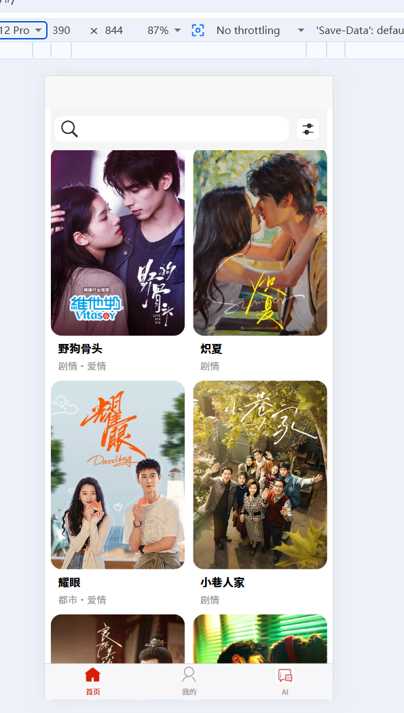 | 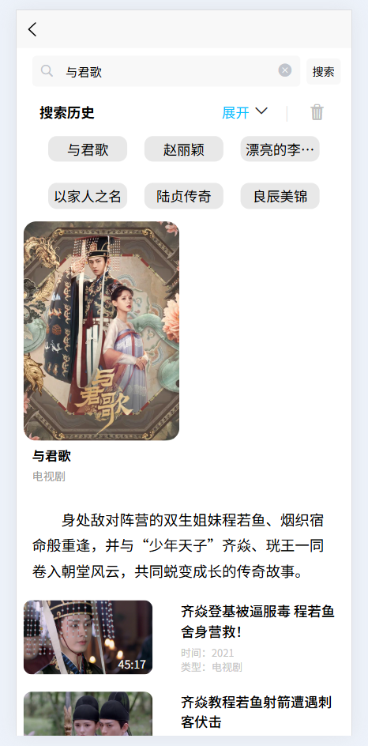 | 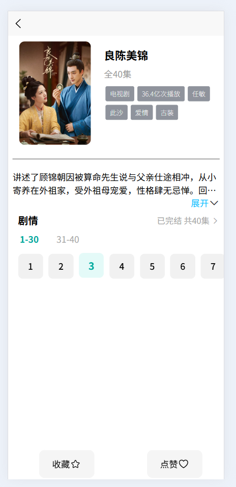 |

| 分类筛选 | 登录注册 | 个人中心 |
|------|--------|--------|
| 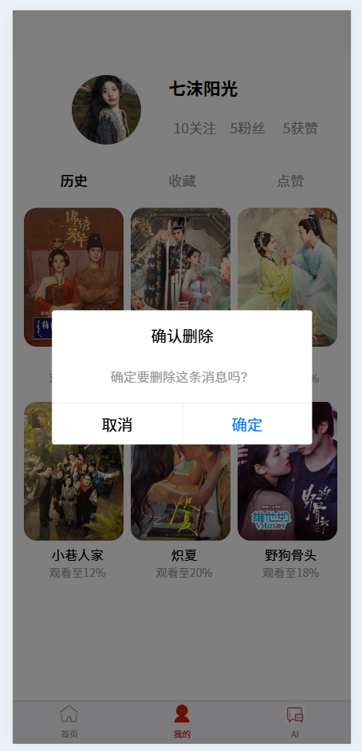 | 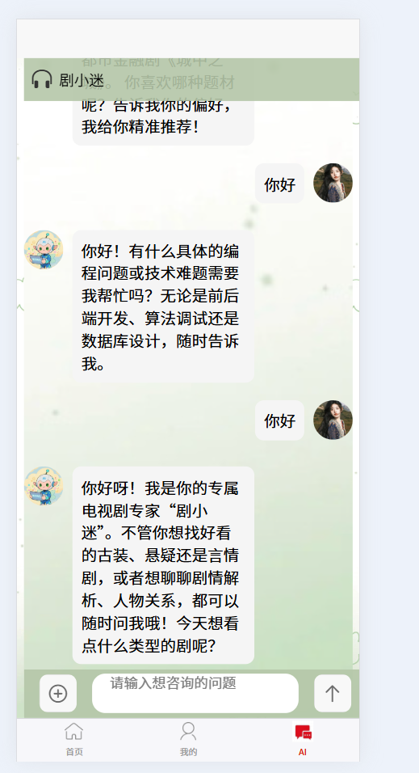 | 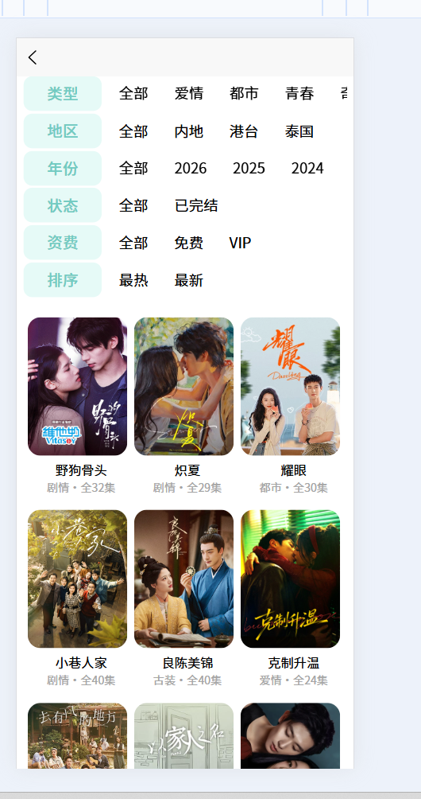 |

| 收藏与历史 | AI 智能助手 | 数据分析看板 |
|------|--------|--------|
| 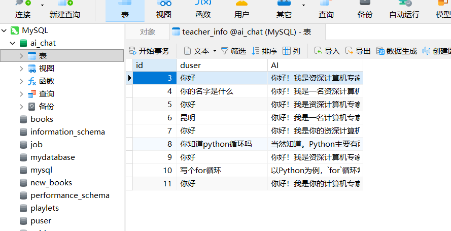 | 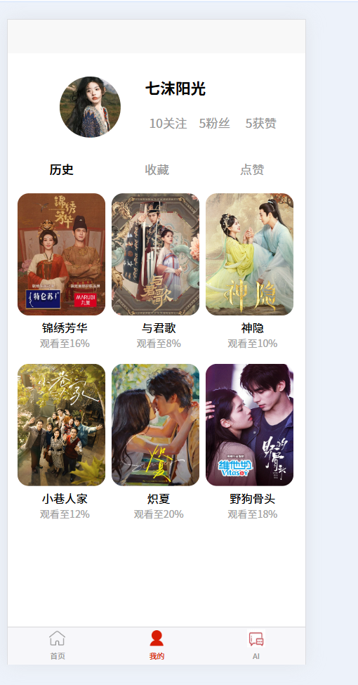 | 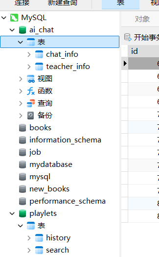 |

| 播放与选集 | 设置与关于 | 通知与反馈 |
|------|--------|--------|
| 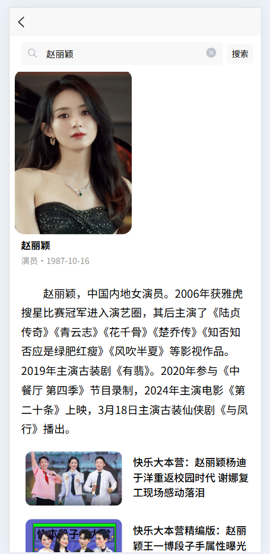 | 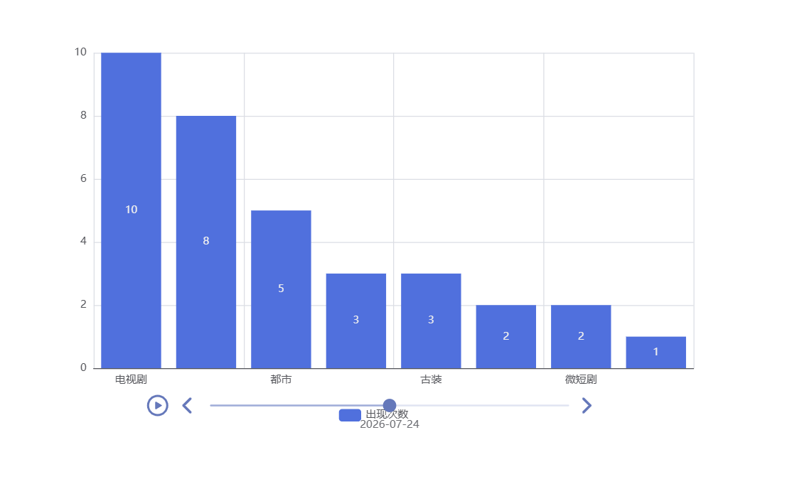 | 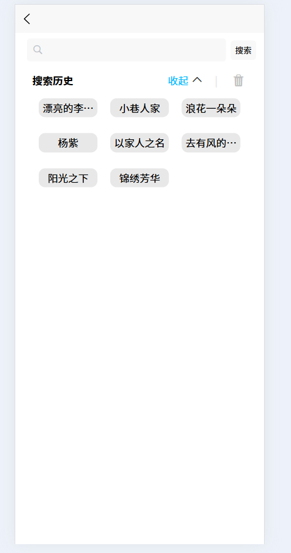 |

---

## 🚀 快速开始

### 前端启动（HBuilderX）

1. 用 **HBuilderX** 打开项目
2. 点击菜单栏 **运行** → **运行到浏览器**
3. 或点击工具栏的 ▶️ 运行按钮

### 后端启动

```bash
# 进入后端目录
cd backend

# 安装 Python 依赖
pip install -r requirements.txt

# 启动 Flask 服务
python app.py

## 🗄️ 数据库配置

# sql="""create database if not exists AI_chat"""
# CREATE TABLE `chat_info` (
#   `id` int NOT NULL AUTO_INCREMENT COMMENT '序号',
#   `duser` varchar(500) NOT NULL COMMENT '提问',
#   `AI` varchar(500) NOT NULL COMMENT '回答',
#   PRIMARY KEY (`id`)
# ) ENGINE=InnoDB AUTO_INCREMENT=1 DEFAULT CHARSET=utf8mb4 COLLATE=utf8mb4_0900_ai_ci

# CREATE TABLE `teacher_info` (
#    `id` int NOT NULL AUTO_INCREMENT COMMENT '序号',
#    `duser` varchar(500) NOT NULL COMMENT '提问',
#    `AI` varchar(500) NOT NULL COMMENT '回答',
#    PRIMARY KEY (`id`)
#  ) ENGINE=InnoDB AUTO_INCREMENT=1 DEFAULT CHARSET=utf8mb4 COLLATE=utf8mb4_0900_ai_ci

# CREATE TABLE `history` (
#   `id` int NOT NULL AUTO_INCREMENT,
#   `card` varchar(5000) NOT NULL,
# 	`update_time` datetime not null,
#   PRIMARY KEY (`id`)
# ) ENGINE=InnoDB AUTO_INCREMENT=1 DEFAULT CHARSET=utf8mb4 COLLATE=utf8mb4_0900_ai_ci
#
# create trigger update_trigger
# before insert on history
# for each ROW
# set new.update_time=NOW()

## 📁 项目结构
text
AI-Drama-FullStack/
├── pages/                      # 页面目录
│   ├── index/                  # 首页
│   ├── detail/                 # 详情页
│   ├── search/                 # 搜索页
│   ├── my/                     # 我的页面
│   └── webview/                # WebView 播放页
├── components/                 # 公共组件
├── stores/                     # 状态管理
├── utils/                      # 工具函数
├── static/                     # 静态资源
├── uni_modules/                # uni-ui 组件
├── backend/                    # 后端服务
│   ├── app.py                  # Flask 主程序
│   ├── dataset.py              # 数据集处理
│   └── search_decrypt.js       # 搜索解密脚本（JS逆向分析）
├── screenshots/                # 项目截图
├── App.vue                     # 应用入口
├── main.js                     # 主文件
├── manifest.json               # 项目配置
├── pages.json                  # 页面路由
├── .gitignore                  # Git 忽略文件
├── LICENSE                     # MIT 开源协议
└── README.md                   # 项目说明
🏆 技术亮点
1. 🔐 API 签名破解
成功破解芒果 TV 搜索接口的 MD5 动态签名机制，通过 JS 逆向分析还原签名算法，实现数据的高效采集。

python
import hashlib

def generate_sign(params):
    """还原芒果TV MD5签名算法"""
    sorted_keys = sorted(params.keys())
    sign_str = '&'.join([f'{k}={params[k]}' for k in sorted_keys])
    return hashlib.md5(sign_str.encode('utf-8')).hexdigest()
2. 🤖 AI 智能助手
集成多角色 AI 对话系统，支持「剧小迷」和「计算机专家」两种角色切换，实现智能问答与剧集推荐。

3. 📱 跨端适配
基于 UniApp 实现一套代码，多端运行，流畅适配 H5 与微信小程序平台。

4. 💾 数据持久化
使用 MySQL 的 JSON 字段灵活存储剧集数据，配合本地缓存实现数据一致性。

📄 License
MIT License © 2026 namew11

🙏 致谢
数据来源：芒果TV

开发框架：UniApp

后端框架：Flask
